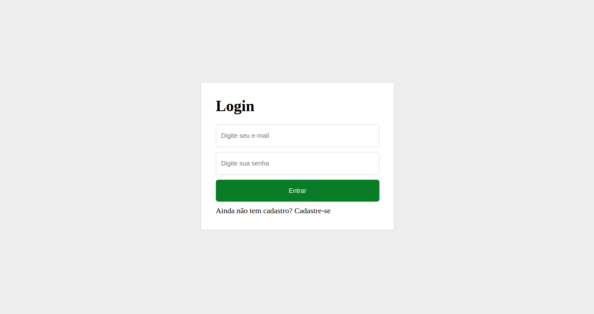
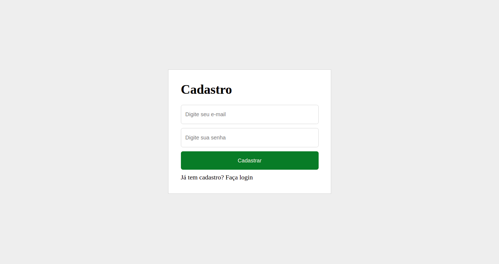
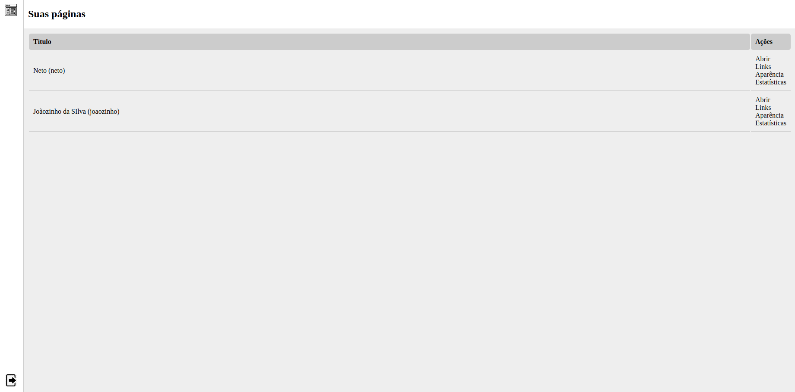
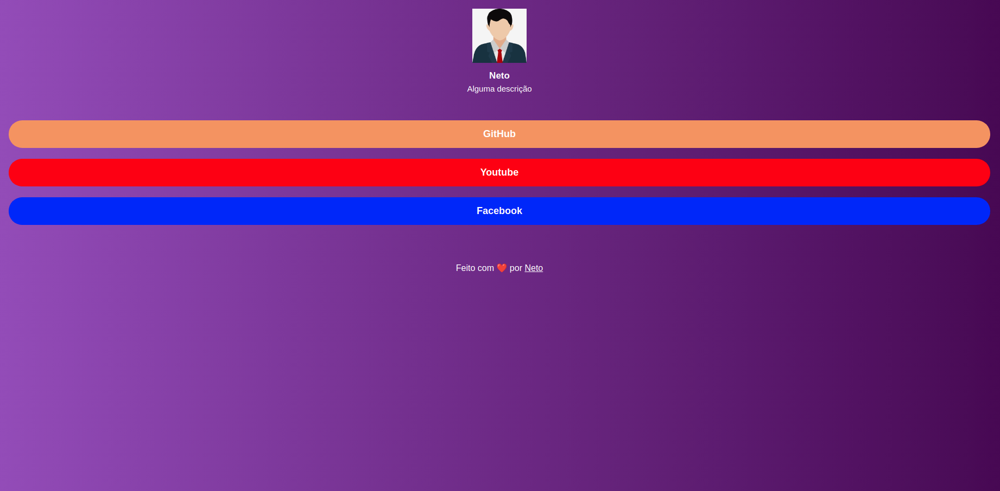
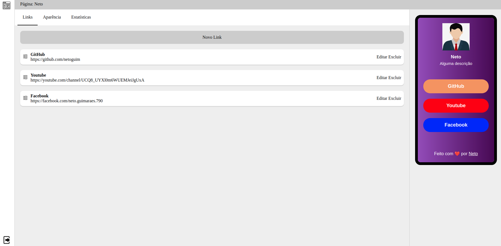
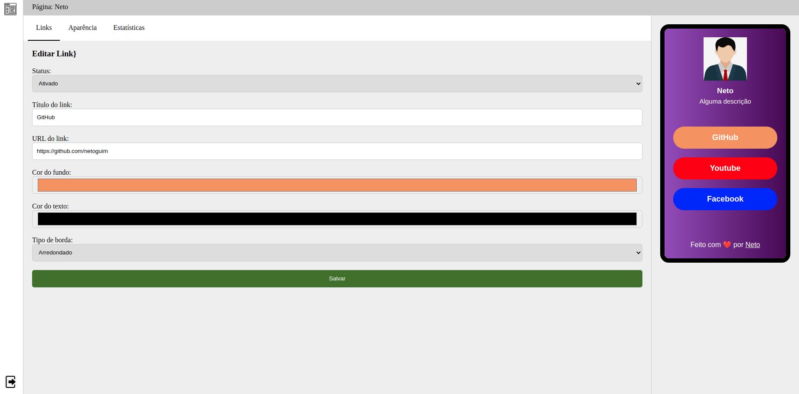

<h1 align="center">:link: Linktree Clone :link:</h1>

O Linktree Clone é um sistema feito em Laravel que tem por objetivo copiar o sistema Linktree exclusivamente para prática do Laravel.

## :camera: Demonstração

  
  
  
  
  
  

 

## :tv: Video Demonstrativo

# Funcionalidades

 - 1 - Login
 - 2 - Register
 - 3 - Logout
 - 4 - Criar links
 - 5 - Listar os links
 - 6 - Reordenar os links
 - 7 - Editar os links
 - 8 - Excluir Links
 - 9 - Ver a página

---

## 🚀 Tecnologias

Este projeto foi desenvolvido com as seguintes tecnologias:

- ✔️ Laravel

- ✔️ Facebook Pixel

- ✔️ Routes

- ✔️ Image Intervention

- ✔️ Middlewares

- ✔️ Migrations

## ⚙ Configuração via Composer

1- Para instalar dependências do projeto:
> composer install

2- Para criar as tabelas:
> php artisan migrate

3- Iniciar o servidor
> php artisan serve

Feito com 💜 por MOACIR GUIMARÃES 👋 [Veja meu Linkedin](https://www.linkedin.com/in/moacir-alves/)
 
